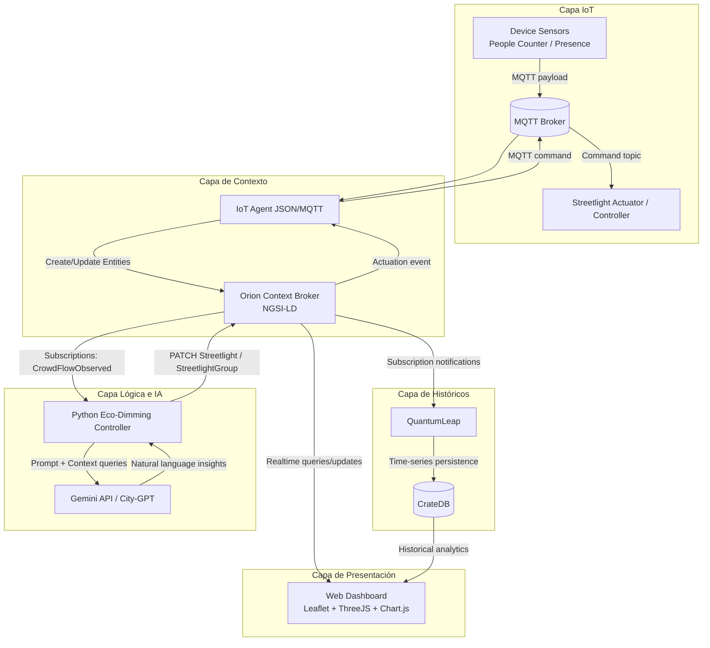

# Arquitectura - Eco-Dimming

## 1. Visión General de la Arquitectura

La solución sigue un patrón de arquitectura orientada a eventos y desacoplada por servicios, apoyada en componentes FIWARE estándar para gestión de contexto urbano en tiempo real.

Principios arquitectónicos aplicados:
- Gestión de estado contextual con Orion Context Broker en modo NGSI-LD.
- Ingesta IoT mediante mensajería MQTT y traducción a entidades semánticas interoperables.
- Procesamiento reactivo por suscripciones (publish/subscribe) para minimizar latencia de respuesta.
- Separación de responsabilidades por capas: ingesta, contexto, histórico, lógica/IA y presentación.
- Persistencia dual: estado actual en broker + histórico temporal en base analítica.

Este enfoque permite que Safety Path ajuste automáticamente iluminación en función de densidad peatonal, manteniendo trazabilidad operacional y capacidad de analítica posterior.

## 2. Diagrama de Arquitectura (Mermaid)

## 3. Descripción de Componentes (Stack Tecnológico)

### 3.1 IoT Agent (JSON/MQTT)
Rol:
- Recibe telemetría desde simuladores/sensores por MQTT (o HTTP si procede).
- Mapea payloads de dispositivo al modelo de entidades NGSI-LD.
- Publica actualizaciones en Orion para entidades como CrowdFlowObserved, Streetlight y StreetlightGroup.

Responsabilidades técnicas:
- Normalización semántica de atributos.
- Conversión de protocolos IoT a operaciones contextuales.
- Enrutado bidireccional para actuar sobre dispositivos físicos/simulados (downlink de comandos).

### 3.2 Orion Context Broker (NGSI-LD)
Rol:
- Núcleo de contexto del sistema (single source of truth del estado actual).
- Almacena y sirve el estado vivo de entidades urbanas.
- Gestiona suscripciones para emitir eventos a servicios consumidores.

Responsabilidades técnicas:
- Persistir estado instantáneo de ocupación y alumbrado.
- Resolver relaciones entre entidades (Device, CrowdFlowObserved, StreetlightGroup, Streetlight).
- Disparar notificaciones ante cambios relevantes para lógica de control y persistencia histórica.

### 3.3 QuantumLeap y CrateDB
Rol:
- Captura de histórico temporal a partir de notificaciones de Orion.
- Almacenamiento eficiente de series temporales para análisis y reporting.

Responsabilidades técnicas:
- Persistir medidas de consumo energético, intensidad y presencia peatonal.
- Habilitar consultas por ventana temporal (noche, tramo horario, zona).
- Alimentar paneles de tendencias y KPIs del frontend.

### 3.4 Backend Python y Gemini API (City-GPT)
Rol:
- Servicio de control Eco-Dimming basado en eventos de contexto.
- Servicio de IA conversacional para consultas operativas.

Responsabilidades técnicas:
- Escuchar eventos de afluencia desde Orion (subscriptions).
- Aplicar reglas de negocio (modo ahorro vs modo seguridad).
- Ejecutar PATCH NGSI-LD sobre StreetlightGroup/Streetlight con nuevos niveles de iluminación.
- Orquestar consultas al broker e histórico para construir contexto de prompts en Gemini.
- Responder preguntas de operadores: farolas defectuosas, zonas más iluminadas, consumo nocturno.

### 3.5 Frontend Web
Rol:
- Interfaz operativa y analítica para monitorización y toma de decisiones.

Stack y responsabilidades:
- Leaflet: mapa base y geovisualización de activos urbanos.
- ThreeJS: capa visual avanzada para representación espacial/3D de intensidad y zonas.
- Chart.js: métricas temporales de consumo, ocupación y comportamiento de grupos.
- Consumo de datos:
  - Orion para tiempo real.
  - QuantumLeap/CrateDB para analítica histórica.

## 4. Flujo de Datos (Data Flow) - Safety Path

1. Un sensor (Device) detecta un peatón o incremento de densidad y publica un payload en un topic MQTT.
2. El IoT Agent consume el mensaje MQTT, lo transforma al modelo NGSI-LD y actualiza la entidad CrowdFlowObserved en Orion.
3. Orion Context Broker registra el nuevo estado y emite notificación a la Lógica Python mediante suscripción activa.
4. El servicio Python evalúa umbrales y contexto (zona, horario, reglas de seguridad) y calcula el nuevo nivel de iluminación.
5. Python envía un PATCH NGSI-LD al StreetlightGroup (y/o Streetlight) en Orion con el valor de intensidad objetivo.
6. Orion propaga cambios: 
   - notifica al IoT Agent para ejecutar comando de actuación sobre farola física/simulada vía MQTT,
   - notifica a QuantumLeap para persistencia histórica.

Nota técnica sobre Actuación (Comandos): En FIWARE, el PATCH enviado por Python sobre Orion no solo actualiza el atributo `illuminanceLevel` en el Context Broker. Como la entidad está vinculada al IoT Agent (registrada como un dispositivo comandado), Orion genera automáticamente una notificación interna hacia el endpoint `/notify` del IoT Agent. Es el IoT Agent quien finalmente traduce esa actualización de contexto en un comando MQTT real hacia el actuador físico/simulado.
7. QuantumLeap guarda series temporales en CrateDB (consumo, intensidad, presencia, estado).
8. El frontend consulta Orion y actualiza visualmente el mapa (heatmap + estado de farolas) en tiempo real.
9. El frontend consulta CrateDB/QuantumLeap para gráficas históricas y KPIs.
10. Cuando un operador consulta el chat, el backend Python combina contexto actual + históricos, llama a Gemini API y devuelve una respuesta técnica en lenguaje natural.

## 5. Estrategia de Despliegue

Todos los componentes backend se orquestan con contenedores Docker y Docker Compose.

Componentes contenedorizados:
- MQTT Broker.
- IoT Agent JSON/MQTT.
- Orion Context Broker (NGSI-LD).
- QuantumLeap.
- CrateDB.
- Backend Python (control Eco-Dimming + API de chat).
- Frontend Web (servido por contenedor web ligero).

Directrices de despliegue:
- Red interna de Docker Compose para comunicación entre servicios.
- Variables de entorno para endpoints, credenciales y claves (incluida Gemini API key).
- Volúmenes persistentes para CrateDB y configuración de componentes.
- Healthchecks para garantizar arranque ordenado y resiliencia básica.
- Separación por perfiles de entorno (dev/lab) para pruebas académicas reproducibles.

## 6. Consideraciones de Escalabilidad y Operación

- Escalabilidad horizontal del backend Python y frontend sin afectar a la semántica de contexto.
- Posibilidad de segmentar por zonas de ciudad con partición lógica de entidades.
- Observabilidad recomendada con logs estructurados por servicio y trazas de eventos de suscripción.
- Diseño compatible con evolución hacia arquitectura cloud nativa (Kubernetes) manteniendo los contratos NGSI-LD.
